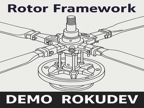

# Rotor POC Application

### Introduction

This repository contains the POC (Proof of Concept) application of the Rotor Framework. 
The POC serves as an unfinished boilerplate with a few ambitious components created to demonstrate the framework’s capabilities. 

Rotor is a modern and innovative Roku framework designed to support the creation of scalable, maintainable, and complex application architectures. The programming patterns used in this POC are intended as recommendations for building modular and reactive Roku applications. Rotor Framework is designed to bring modern architectural principles to Roku development. It provides a structured, reactive, and scalable foundation for building robust applications — whether small or large in scope. Its core goal is to empower developers to write modular, maintainable code,	use a minimal set of flexible, composable patterns and express complex behavior through clear structure and reusable logic.

The Rotor framework consists of two subsystems that could work together: 
* ViewBuilder
* Multi-thread MVI pattern 

#### ViewBuilder Example:

```js
    m.appFw.render({
        nodeType: "LayoutGroup",
        fields: {
            translation: [90, 60],
            itemSpacings: [60]
        },
        children: [
            {
                nodeType: "Label",
                fields: {
                    text: "Simple TodoList Example (driven by Rotor Framework)",
                    font: "font:LargeSystemFont"
                }
            },
            {
                id: "todoList",
                viewModel: ViewModels.TodoList
            }
        ]
    })
```

#### MVI Example - listener:

```js
    m.appStoreDispatcher.addListener({
        shouldUpdate: function(props, newState) as object
            return props.activePageKey <> newState.activePageKey
        end function,
        mapStateToProps: sub(props, state)
            props.prevActiveKey = props.activePageKey ' Stores the previous page key.
            props.activePageKey = state.activePageKey ' Gets the new active page key.
        end sub,
        callback: "proceedPageTransition"
    })
```

#### MVI Example - dispatching:

```js
    m.appStoreDispatcher.dispatch({
        type: IntentTypes.AppStore.SET_ACTIVE_PAGE_KEY,
        payload: {
            activePageKey: m.props.optionKey
        }
    })
```


#### How to run POC App
- Rename `.vscode/sample.settings.json` to `.vscode/settings.json`
- Rename `sample.env` to `.env`
    - Set variable: `ROKU_DEV_TARGET=<your Roku device's local IP>`
    - Set variable: `ROKU_DEV_PASS=<device developer password>`
 
- Run `npm install`
- Use VSCode Launch > Run Debug | Run Tests

---


# Rotor Framework

Framework documentation with code examples. (code samples based on POC)

***[Documentation](src/source/libs/rotorFramework/README.md)***


## Contribute

For any questions ping me on [Roku Developers Slack channel](https://rokudevelopers.slack.com/team/U05UR749546) or [LinkedIn](https://www.linkedin.com/in/mobalazs).


## Credits

##### Icons:
This project uses icons from the Android Asset Studio, which are licensed under the **Apache License 2.0**. For more information about the icons and the license, please visit the following website: Android Asset Studio: https://github.com/romannurik/AndroidAssetStudio

##### App icon:
Modified image of the original: https://www.publicdomainpictures.net/en/view-image.php?image=152257&picture=main-rotor-of-puma-helicopter  
Lynn Greyling has released this “Main Rotor Of Puma Helicopter” image under **Public Domain** license. It means that you can use and modify it for your personal and commercial projects.  
Image editor with which I modified the original: GIMP

##### Fonts
Fonts: Kingsbridge font family. Kingsbridge is trademark of Typodermic Fonts Inc.  
Fonts are under “desktop license”. Download link: Free commercial use fonts https://typodermicfonts.com/downloads/

##### Integrated animate library
https://github.com/haystacknews/animate | MIT license | Copyright (c) 2022 Haystack TV Inc. 
